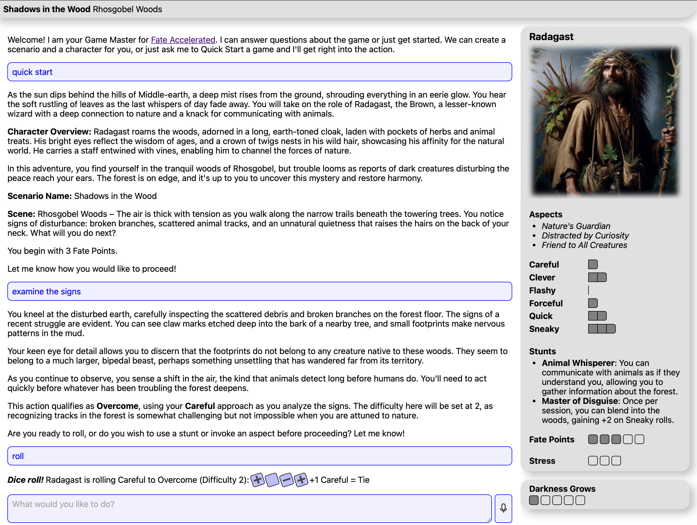
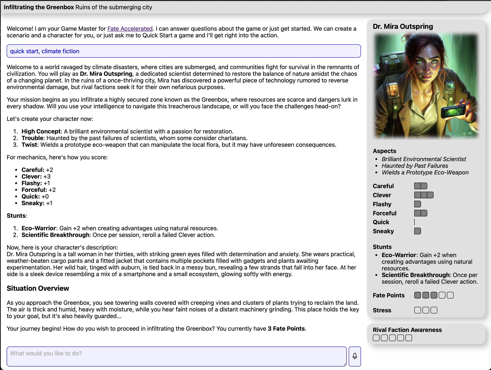
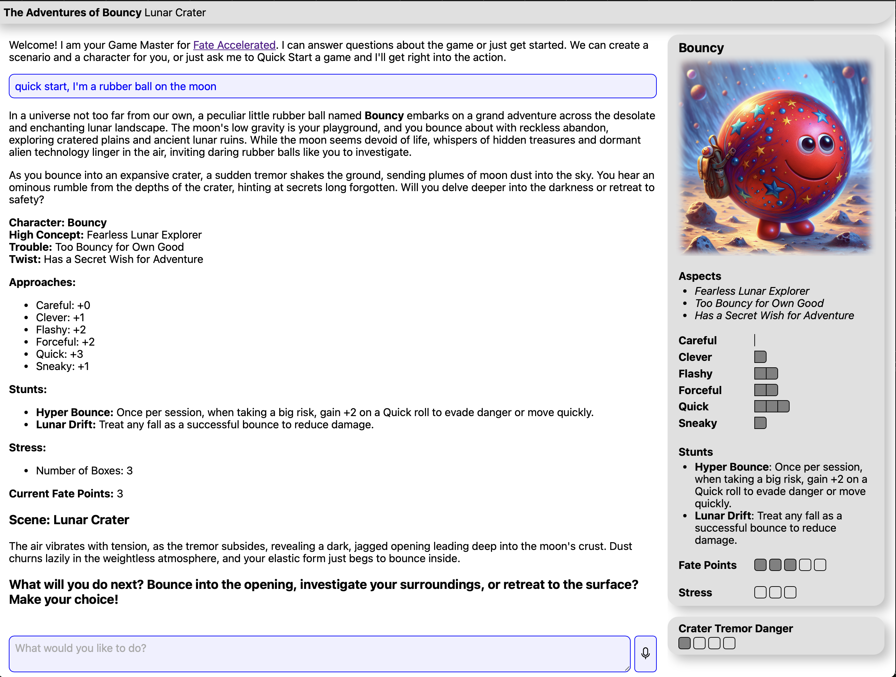

# Tagz Game Master

## Introduction

This is an automated Game Master for [Fate Accelerated](https://evilhat.com/product/fate-accelerated-edition/) with a custom UI and character portraits generated with Dall-E. I've had reasonable luck with gpt-4o-mini, although it makes occasional mistakes. The full 4o model is a bit better but will still mess up occasionally. As typical for a GPT it will accept corrections without a fuss.

## Usage

1. Install bun: https://bun.sh/docs/installation
2. Install modules: `bun install`
3. Get an OpenAI API Key from https://platform.openai.com/api-keys (be sure it is enabled for dall-e-3 and the model you want to use, gpt-4o-mini works pretty well)
4. Export your key `export OPENAI_API_KEY=<key>`
5. Export your desired model `export MODEL_NAME=<name>` (or let it default to gpt-4o-mini)
6. Start app: `bun dev` (for production, `bun rebuild && bun start`)
7. Open page in your browser: http://localhost:3000

## Save games

The game is saved to `game.json` which prevents losing the message chain when the server restarts in dev mode. You can start fresh at any time by deleting this file.
